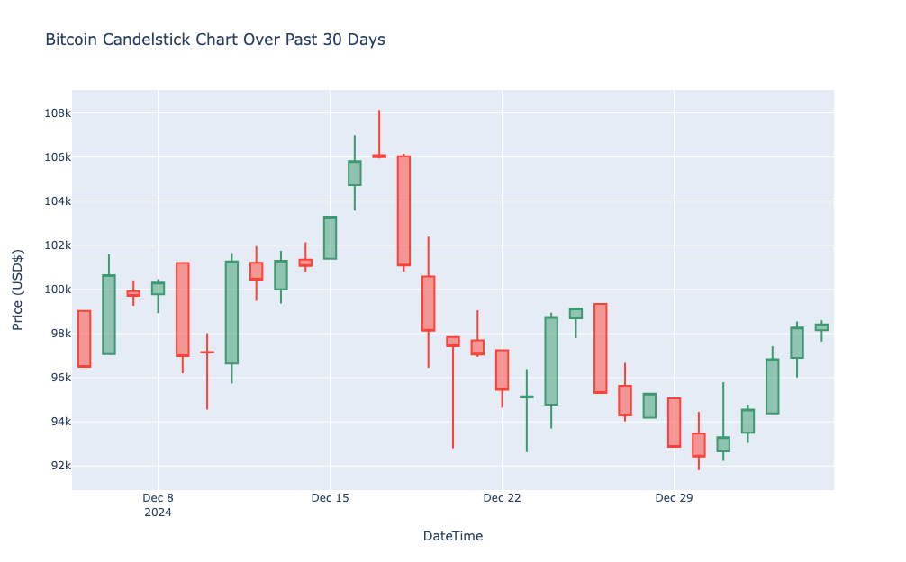

## About Me 
LinkedIn: https://www.linkedin.com/in/grace-qi-luan/

I'm a data scientist with **dual master’s degrees** in Applied Data Science and Communication, blending technical expertise with compelling storytelling to transform complex data into actionable insights. 

With **over 10 years of experience in marketing and business consulting** across various industries, including healthcare, insurance, and consumer products, I excel in **data-informed decision-making and strategic consultation**. Passionate about leveraging my expertise to tackle diverse challenges, I am eager to explore new industries and deliver impactful results.

Proficient in Python, R, SQL, MySQL, Power BI, Google Looker Studio, Google Analytics, and digital advertising platforms, I bring a results-driven approach to every project.

## Education
- M.S. Applied Data Science, Syracuse University
- M.A. Strategic Public Relations, University of Southern California
- B.A. Communications, Peking University
  
# Data Science Projects
- Project 1: Customer Churn Prediction with a Classification Model
- Project 2: Realtime Bitcoin Price API Scraping and Visualizion

## [Project 1 - Customer Churn Prediction with a Classification Model](https://github.com/GraceLQ/BCG_Customer_Churn_Classification.git)

- Completed a customer churn analysis simulation for PowerCo, identifying essential client data and outlining a strategic investigation approach.
- Conducted efficient data analysis using Python, including Pandas and Numpy. Employed data visualization techniques for insightful trend interpretation, including bar chart, line chart, histogram and heatmap.
- Completed the feature engineering and optimization of a **random forest model**, achieving a 90% accuracy rate in predicting customer churn. Conducted further evaluations on **a confusion matrix, the precision and recall scores, and importance of different features**.
- Completed a concise executive summary for BCG Associate Director, delivering actionable insights for informed decision-making based on analysis.

**[This is a certified BCG Data Science Job Simulation on Forage.](https://forage-uploads-prod.s3.amazonaws.com/completion-certificates/SKZxezskWgmFjRvj9/Tcz8gTtprzAS4xSoK_SKZxezskWgmFjRvj9_YGFsgu2Mqfs5SNxrW_1735360236276_completion_certificate.pdf)**

 

## [Project 2 - Realtime Bitcoin Price API Scraping and Visualization](https://github.com/GraceLQ/bitcoin_realtime_price)

This project demonstrates how I scraped, processed, and visualized Bitcoin price data using the CoinGecko API via the Python wrapper PyCoinGecko. It retrieves Bitcoin price data for the previous 30 days, processes it into a structured DataFrame, and visualizes the results with an interactive HTML-based candlestick chart generated using Plotly.

- Worked with **RESTful APIs** for retrieving real-time and historical data.
- Used Pandas for data manipulation, such as aggregating daily price metrics, and converting **time-series data**.
- Created interactive candlestick charts using **Plotly**.

