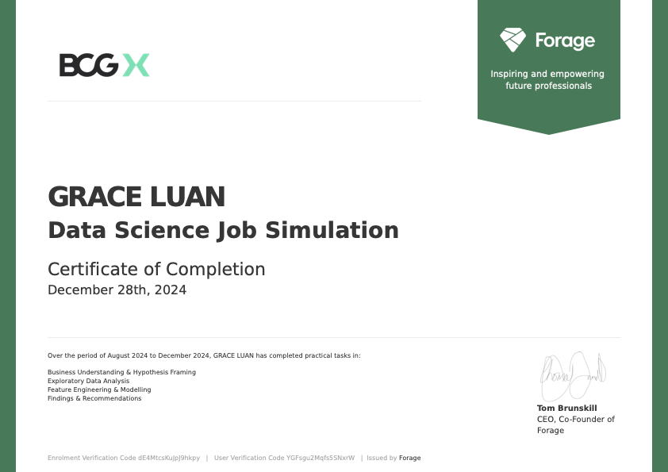

## Education
- M.S. Applied Data Science, Syracuse University
- M.A. Strategic Public Relations, University of Southern California
- B.A. Communications, Peking University
  
# Data Science Projects

## [Project 1 - Customer Churn Prediction with a Classification Model](https://github.com/GraceLQ/BCG_Customer_Churn_Classification.git)

- Completed a customer churn analysis simulation for PowerCo, demonstrating advanced data analytics skills, identifying essential client data and outlining a strategic investigation approach.
- Conducted efficient data analysis using Python, including Pandas and Numpy. Employed data visiualization techniques for insightful trend interpretion, including bar chart, line chart, histogram and heatmap.
- Completed the feature engineering and optimization of a random forest model, achieving a 90% accuracy rate in predicting customer churn. Conducted further evaluations on a confusion matrix, the precision and recall scores, and importance of different features.
- Completed a concise executive summary for BCG Associate Director, delivering actionable insights for informed decison-making based on analysis.

**This is a certifief BCG Data Science Job Simulation on Forage.**

 

## Project 2 Regression
xxxxx
