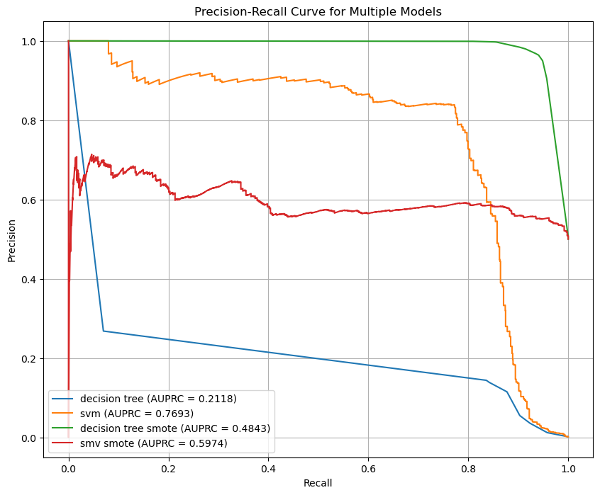
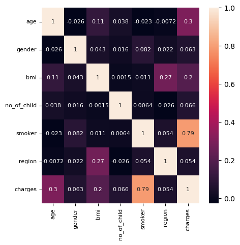
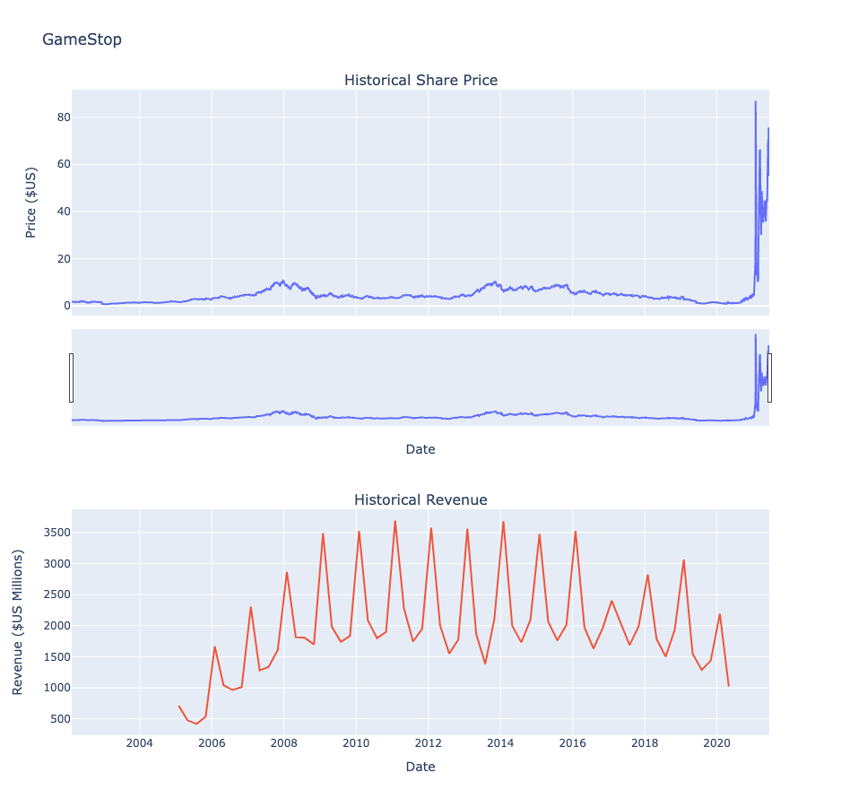

## About Me 
LinkedIn: https://www.linkedin.com/in/grace-qi-luan/

I'm a data scientist with **dual master’s degrees** in Applied Data Science and Communication, blending technical expertise with compelling storytelling to transform complex data into actionable insights. 

With **over 10 years of experience in marketing and business consulting** across various industries, including healthcare, insurance, and consumer products, I excel in **data-informed decision-making and strategic consultation**. Passionate about leveraging my expertise to tackle diverse challenges, I am eager to explore new industries and deliver impactful results.

Proficient in Python, R, SQL, MySQL, Power BI, Tableau, Google Looker Studio, Google Analytics, and digital advertising platforms, I bring a results-driven approach to every project.

## Education
- M.S. Applied Data Science, Syracuse University
- M.A. Strategic Public Relations, University of Southern California
- B.A. Communications, Peking University
  
# Data Science Projects
- Project 1: Customer Churn Prediction with a Classification Model
- Project 2: Credit Card Fraud Detection Using Decision Tree and SVM
- Project 3: Medical Insurance Premium Prediction Using Ridge Regression Model
- Project 4: Stock and Crypto Price Analysis through API Integration and Web Scraping

## [Project 1 - Customer Churn Prediction with a Classification Model](https://github.com/GraceLQ/BCG_Customer_Churn_Classification.git)

- Completed a customer churn analysis simulation for PowerCo, identifying essential client data and outlining a strategic investigation approach.
- Conducted efficient data analysis using Python, including Pandas and Numpy. Employed data visualization techniques for insightful trend interpretation, including bar chart, line chart, histogram and heatmap.
- Completed the feature engineering and optimization of a **random forest model**, achieving a 90% accuracy rate in predicting customer churn. Conducted further evaluations on **a confusion matrix, the precision and recall scores, and importance of different features**.
- Completed a concise executive summary for BCG Associate Director, delivering actionable insights for informed decision-making based on analysis.

**[This is a certified BCG Data Science Job Simulation on Forage.](https://forage-uploads-prod.s3.amazonaws.com/completion-certificates/SKZxezskWgmFjRvj9/Tcz8gTtprzAS4xSoK_SKZxezskWgmFjRvj9_YGFsgu2Mqfs5SNxrW_1735360236276_completion_certificate.pdf)**

 

## [Project 2 - Credit Card Fraud Detection Using Decision Tree and SVM](https://github.com/GraceLQ/credit_card_fraud_detection_models)

- Built a machine learning model to detect credit card fraud using a dataset of European transactions from September 2013, anonymized through Principal Component Analysis (PCA) for privacy while preserving essential patterns.
- Addressed imbalanced data using SMOTE for oversampling and class weighting to enhance minority class representation.
- Preprocessed data with StandardScaler and Normalizer to ensure consistency and scale for models.
- Experimented with Decision Tree and Support Vector Machine (SVM) models, optimizing hyperparameters and focusing on precision-recall performance.
- **Outcome:** The SVM with class weight adjustment delivered the best results, achieving an ROC AUC of 0.988 and an AUPRC of 0.769, demonstrating strong performance in handling fraud detection.
- **Challenges:** Tackled class imbalance (fraud cases being a small fraction) and overlapping features between fraudulent and legitimate transactions. Future improvements include incorporating features like device fingerprinting, transaction location, and user behavior patterns for better precision and recall.
  

## [Project 3 - Medical Insurance Premium Prediction Using Ridge Regression Model](https://github.com/GraceLQ/Medical_insurance_ridge_regression)
- Built a Ridge regression model with polynomial transformations and hyperparameter tuning, achieving an R² score of 0.783, while minimizing overfitting and enhancing predictive performance.
- Identified smoker status as the most influential factor in pricing, followed by age and BMI, providing actionable insights for risk assessment and personalized premium design.
- Recommended insurers focus on critical cost drivers, leveraging insights for targeted wellness programs and risk mitigation strategies, while avoiding overly penalizing certain demographics such as gender or region, which showed weaker influence.
  

## [Project 4 - Stock and Crypto Price Analysis through API Integration and Web Scraping](https://github.com/GraceLQ/Stock_Crypto_Scraping_API)

This project demonstrates how I scraped, processed, and visualized Bitcoin price data using the CoinGecko API via the Python wrapper PyCoinGecko. It retrieves Bitcoin price data for the previous 30 days, processes it into a structured DataFrame, and visualizes the results with an interactive HTML-based candlestick chart generated using Plotly.

Additionally, web scraping was employed to extract revenue data for Tesla and GameStop from Macrotrends.com, and the Python library yfinance was utilized to retrieve their stock price data. The analysis compared price trends with revenue patterns to identify anomalies and profiled suspicious stock activities, such as short-selling patterns.

- Worked with **RESTful APIs** for retrieving real-time and historical data.
- Used Pandas for data manipulation, such as aggregating daily price metrics, and converting **time-series data**.
- Created interactive candlestick charts using **Plotly**.
- Used web scrapping techniques with libraries such as **BeautifulSoup** for extracting financial data from the internet. Used yfinance to fetch stock price and conduct financial analysis.

